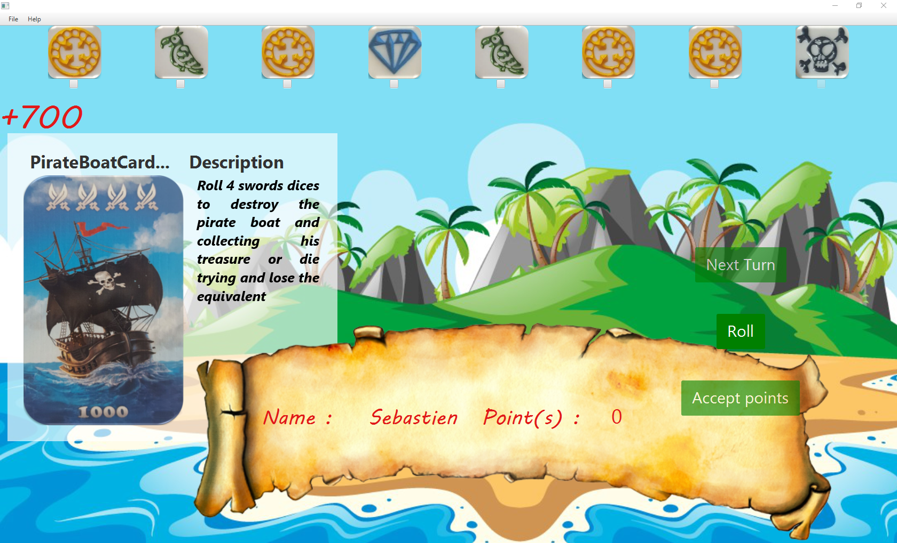
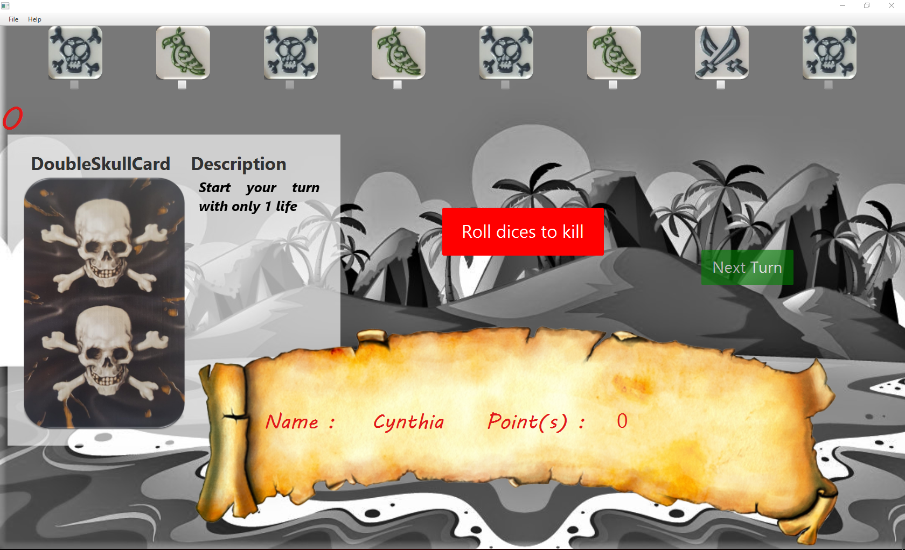

# PirateDice (Mille Sabord)

## Purpose

This project is a very simple exercice that I build like I do a puzzle. I do it simply to relax and keep on touch with Java. Here I implement this cool game I've played with friends. 

## The Game
<!---->

## Actual Interface (Temp)

### On the Island 

### On the Death Island

## Phase(s)

| # | Life cycle |                  Description                       | State |
|---|------------|----------------------------------------------------|-------|
| 1 | ALPHA      | Building the minimum viable product of the game    |   X   |
| 2 | BETA       | Enhance gaming experience                          |       |
| 3 | RELEASE    | Deploying a Mobile version of the game             |       |
| 4 | RELEASE    | Implementing a multiplayer game experience         |       |

## What have been done

- [x] Generating Models
- [x] Coding a singleton repository
- [x] Preparing a Preferences files 
- [x] Preparing a Strong Assets 
- [ ] Preparing a Music theme
- [ ] Preparing a Sound effects
- [ ] Preparing nice visuals aspects 

### Business logic

#### GamePlay
- [x] Implementing rolling dices
- [x] Implementing the switch card
- [x] Implementing the Death
- [x] Implementing the lost tempPts when player obtain three Deaths 
- [x] Implementing the beat the death
- [x] Implementing the end turn bonus when all dices on the table counts
- [ ] Implementing minus pts for all other players when beat the death
- [ ] Implementing the ending game
- [ ] Implementing the setup menu

#### Cards 
-End Turn effect-
- [x] Implementing the BL for : PirateCard
- [ ] Implementing the BL for : Death island PirateCard
- [x] Implementing the BL for : GoldenPiece  
- [x] Implementing the BL for : DiamondCard 
- [x] Implementing the BL for : PirateBoatCardEasy
- [x] Implementing the BL for : PirateBoatCardMedium
- [x] Implementing the BL for : PirateBoatCardHard
- [x] Implementing the BL for : MonkeyPirateCard

-During turn effect- 
- [x] Implementing the BL for : SimpleSkullCard  
- [x] Implementing the BL for : DoubleSkullCard 
- [x] Implementing the BL for : WitchCard  
- [ ] Implementing the BL for : ChestCard 

### Issue(s)
- [x] Line 133 :: service : EVERYTIME WE PLAY PTS INCREMENT for PirateBoatCards 
- [x] Starting game problem Death doesn't make any effect
- [ ] Factorizing MonkeyPirateCard

## Rules

-From Wikipedia-

At the beginning of the game, the names of the teammates are noted on one side of the scoring block in order to be able to enter the points accordingly during the game. The pirate cards are shuffled and placed in the middle of the table as a hidden draw pile. Each player also gets an overview card with the possible dice combinations.

The game is played in a clockwise direction. A starting player gets the dice and reveals the top card of the draw pile, which is placed face up on the pile. The face-up card affects the throws of the active player by defining certain rules, bonus options, and play options during the turn:

The treasure island allows the player to place dice on the card and secure them if he rolls three skulls. In that case, he gets the points credited from the saved dice.
The pirate doubles the results of the current round.
At the skull (one or two skulls) the round starts with one or two skulls.
At the guardian once in the round a skull can be rolled again, even alone.
In the pirate ship , a player must roll at least the displayed number of sabers. If he does, he will receive a bonus in addition to his score, otherwise he will not get any points in that round.
In the case of the gold coin , the round begins with an additional gold coin, which is counted both individually and in combination. If a player achieves a 9-point combination with the card, he immediately wins the game ("pirate magic").
For the diamond , the round begins with an additional diamond, which is counted both individually and in combination. If a player achieves a 9-point combination with the card, he immediately wins the game ("pirate magic").
In the animals , monkeys and parrots are considered together as a combination.
Then the player starts his round ("Kaperfahrt") and throws with all eight dice. He tries to cast as high as possible dice combinations in the form of as many of the same symbols and collect. The player can decide after each roll, which dice he places to the side and which he again dices, thereby he can throw any number of dice again and also dices, which were already put aside, again to take. When throwing, however, the player has to consider two rules: 

A throw must always consist of at least two dice.
Skull symbols must be set aside and must not be thrown again.
The litters are scored as follows: 

3 equal symbols earn 100 points
4 equal symbols bring 200 points
5 identical symbols bring 500 points
6 equal symbols bring 1000 points
7 identical symbols bring 2000 points
8 identical symbols bring 4000 points
In addition, gold coins and diamonds each earn 100 points, regardless of whether they are part of a combination or individually. If a player also succeeds in scoring points with all eight dice, he will receive an additional bonus of 500 points.

As soon as a player has thrown his third skull and put it aside, his round ends immediately and he loses all points earned in that round. The player must therefore stop early enough to get points before the third skull is rolled. If a player rolls four or more skulls with his first roll, he puts them aside and rolls all remaining dice ("Ride to Skull Island"). Whenever he rolls another skull, he puts it to the others and rolls on with the remaining dice. If he no longer dices a skull, his round ends and he gets zero points, but all other players get deducted 100 points for every roll of skulls he rolls.

After a player finishes his round, all points scored (and minus points in the case of the journey to Skull Island) are recorded on the score board and it is the turn of the next player. The game ends after the round in which a player has reached 6000 points or more. All players after him are allowed to play a caper ride in this case and should a player exceed the result, he may also play a ride himself. If after the final round by deductions no player has 6000 or more points, the game continues, otherwise the player with the most points wins. [1]

## Copyright
***
- Author : Haim Shafir-https://www.youtube.com/embed/uT5c_MfSZzY
- Design : Jose Pedro
- Programmor : Maxime Laniel 

- Image(s) : <a href="https://www.freepik.com/free-vector/island-background-design_1020626.htm">Designed by Brgfx</a> 
***