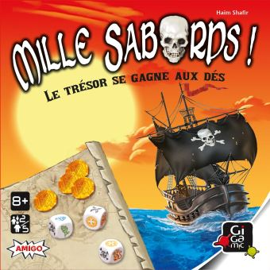
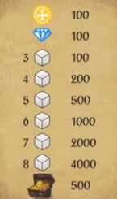

# PirateDice (Mille Sabord)

## Purpose

This project is a very simple exercice that I build like I do a puzzle. I do it simply to relax and keep on touch with Java. Here I implement this cool game I've played with friends. 

## The Game

## Phase(s)
| ID |                    Description                       |
| ---|------------------------------------------------------|
|  1 |    Building the Business logic of the game (Console) |
|  2 |    Building the game with a Real UI                  |
|  3 |    Doing a Mobile version (Maybe)                    | 

- [x] 1-Doing the minimum viable product of the game
- [x] 2-Filling the cooler with beer!
- [ ] 3-Completing the logic patterns of the game

# Rules

35 cartes Pirates
-Coffre au trésor
        -safe dice
-Sorcière
        -Relance tete de mort une fois
-Pirate 
        -Tous les points sont doublés
        -Double les points de l'ile aux morts
 -Singe et perroquet
        -Les singes et perroquets sont identiques
-Or
        -Ajoute une piece d'or
        -Si tourne tous les dés en or + carte or on gagne la partie 
-Diamant
        -Ajoute une piece de Diamant
        -Si tourne tous les dés en diamants + carte diamant on gagne la partie 
-Tête de mort
        -Une tete
        -Deux tete
    
-Les bateaux (Pirate Ship)
  -2 épées => 300
  -3 épées => 500
  -4 épées => 1000
    
-Joute 6000 points

