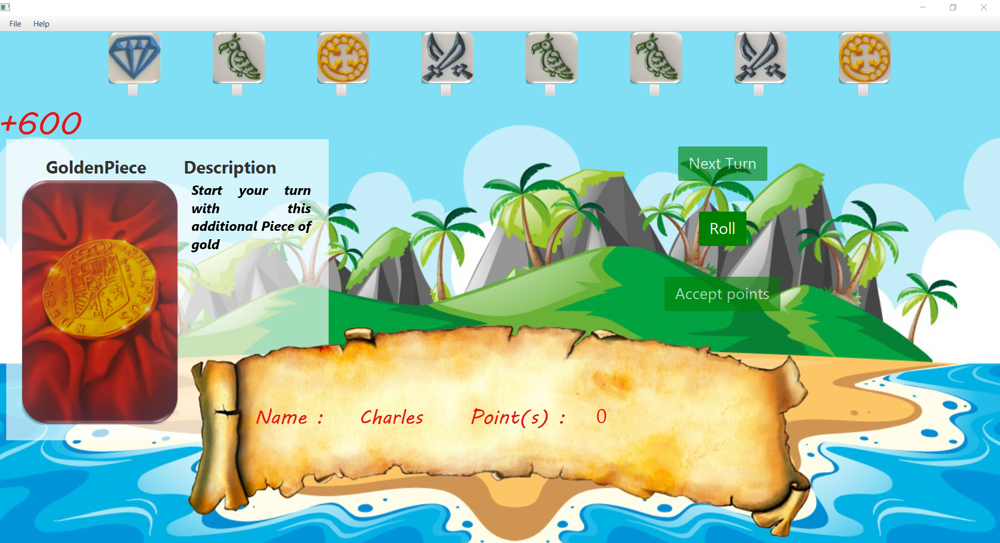
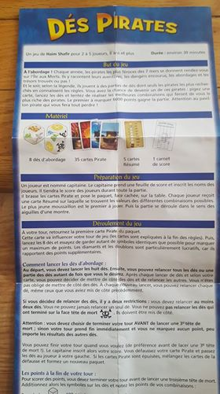
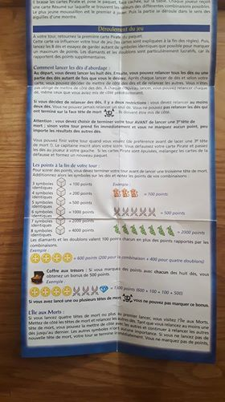
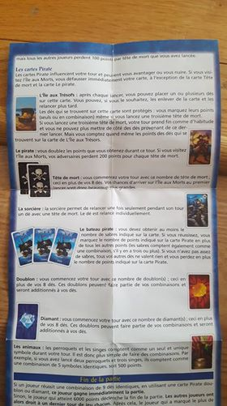
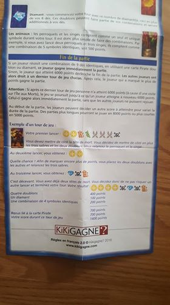

# PirateDice (Mille Sabord)

## Purpose

This project is a very simple exercice that I build like I do a puzzle. I do it simply to relax and keep on touch with Java. Here I implement this cool game I've played with friends. 

## The Game

## Actual Interface (Temp)

## Phase(s)

| # | Life cycle |                  Description                       | State |
|---|------------|----------------------------------------------------|-------|
| 1 | ALPHA      | Building the minimum viable product of the game    |  [x]  |
| 2 | BETA       | Enhance gaming experience                          |  [ ]  |
| 3 | RELEASE    | Deploying a Mobile version of the game             |  [ ]  |
| 4 | RELEASE    | Implementing a multiplayer game experience         |  [ ]  |

## What have been done

- [x] Generating Models
- [x] Coding a singleton repository
- [x] Preparing a Preferences files 
- [x] Preparing a Strong Assets 

### Business logic

#### GamePlay
- [x] Implementing rolling dices
- [x] Implementing the switch card
- [x] Implementing the Death
- [x] Implementing the lost tempPts when player obtain three Deaths 
- [ ] Implementing the beat the death
- [ ] Implementing the ending turn
- [ ] Implementing the setup menu

#### Cards 
-End Turn effect-
- [x] Implementing the BL for : PirateCard
- [x] Implementing the BL for : GoldenPiece  
- [x] Implementing the BL for : DiamondCard 
- [x] Implementing the BL for : PirateBoatCardEasy
- [x] Implementing the BL for : PirateBoatCardMedium
- [x] Implementing the BL for : PirateBoatCardHard
- [ ] Implementing the BL for : MonkeyPirateCard

-During turn effect- 
- [x] Implementing the BL for : SimpleSkullCard  
- [x] Implementing the BL for : DoubleSkullCard 
- [ ] Implementing the BL for : WitchCard  
- [ ] Implementing the BL for : ChestCard 

### Issue(s)
- [x] Line 133 :: service : EVERYTIME WE PLAY PTS INCREMENT for PirateBoatCards 

<!--
35 cartes Pirates
-Coffre au trésor
        -safe dice
-Sorcière
        -Relance tete de mort une fois
-Pirate 
        -Tous les points sont doublés
        -Double les points de l'ile aux morts
 -Singe et perroquet
        -Les singes et perroquets sont identiques
-Or
        -Ajoute une piece d'or
        -Si tourne tous les dés en or + carte or on gagne la partie 
-Diamant
        -Ajoute une piece de Diamant
        -Si tourne tous les dés en diamants + carte diamant on gagne la partie 
-Tête de mort
        -Une tete
        -Deux tete
-Les bateaux (Pirate Ship)
  -2 épées => 300
  -3 épées => 500
  -4 épées => 1000
-Joute 6000 points
-->
## Rules

## Copyright
***
- Author : Haim Shafir
- Design : Jose Pedro
- Programmor : Maxime Laniel 

- Image(s) : <a href="https://www.freepik.com/free-vector/island-background-design_1020626.htm">Designed by Brgfx</a> 
***